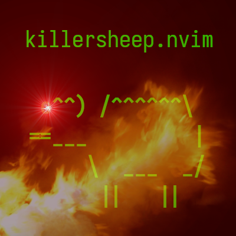

A port of [killersheep](https://github.com/vim/killersheep) for Neovim v0.7+
_(with unnecessary gore!)_

Install, then play by running `:KillKillKill`

To enable sounds, install `afplay`, `paplay` or `cvlc` and make sure the program
is available in your `$PATH`

## Configuration

Some settings can be changed by calling the `setup()` function. There is no need
to call it if you are happy with the defaults.

For example, the default settings look like this:

```lua
require("killersheep").setup {
  gore = true,           -- Enables/disables blood and gore.
  keymaps = {
    move_left = "h",     -- Keymap to move cannon to the left.
    move_right = "l",    -- Keymap to move cannon to the right.
    shoot = "<Space>",   -- Keymap to shoot the cannon.
  },
}
```

Any options not specified when calling `setup()` will be given their default
values.

## Testimonials


